**Estagiário de desenvolvimento na FOeng Group** · Albergaria-a-Velha, Portugal

 

### Sobre mim

Trabalho na aplicação Flutter usada em campo pelas equipas da FOeng Group e no painel de gestão interna da empresa, ambos integrados com a mesma base de dados.

Tenho uma base sólida em Java e C#, construída em projetos pessoais, e vou iniciar o **CTeSP em Cibersegurança** no Politécnico de Águeda em setembro de 2026.

 

### Tecnologias

 

### Projetos

  
  
  

 

### Experiência

