**Estagiário de desenvolvimento na FOeng Group** · Albergaria-a-Velha, Portugal

 

### Sobre mim

Estagiário de desenvolvimento na FOeng Group, onde trabalho principalmente com Flutter.

Tenho uma base sólida em Java e C#, construída em projetos pessoais, e vou iniciar o **CTeSP em Cibersegurança** no Politécnico de Águeda em setembro de 2026.

 

### Tecnologias

  
  
  
  
  
  
   
  
  
  
  
  
  
  

 

### Projetos

  
  
  

 

### Experiência

